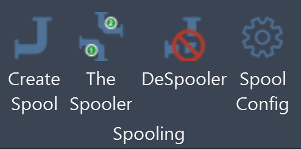

# Spool Tools for Revit

A Revit add-in (builds for **Revit 2025** and **Revit 2026**) that produces
production-ready pipe spool drawings from **Autodesk Fabrication parts** — one
spool at a time (**Create Spool**) or a whole batch at once (**The Spooler**),
with a shared **Spool Config** for project-level defaults and a **DeSpooler**
command for reverting.

All four buttons live on a single **Spool Tools** ribbon tab. Dialogs are
modeless — you can pick parts in the model while they're open, adjust
selections, and produce sheets without closing.

---

## ⚠ Disclaimer

This code is provided by Autodesk for evaluation purposes only, as an example
of what is possible with the Autodesk platform and APIs. **THIS CODE IS NOT
INTENDED FOR USE IN PRODUCTION.** Autodesk makes no representations,
warranties, or commitments about the code. This code is not fully tested
and may include errors or faults that may cause total data loss or system
failure. No further updates to this tool are promised or implied — the
version published here may be the last, and may never be revised after the
posting date.

The MIT license applies to the source — see [LICENSE](LICENSE) — but the
evaluation-only nature above takes precedence over any "use however you
like" reading of the MIT terms.

---

## What it does

- **Create Spool** — pick a set of fabrication parts, get one spool sheet
  with ortho + iso views laid out third-angle on a project titleblock, an
  auto-suggested Spool Number, sequenced Item Numbers, tags with an
  overlap-aware placement engine, and (optionally) dimensions.
- **The Spooler** — walk a connected pipe network from a **Start** element
  and split it at user-picked **Break** elements (and at branches off tees),
  producing one sheet per resulting spool with auto-sequenced numbers from a
  token template like `{Service}-{ID}-{N:00}`.
- **Spool Config** — project-level defaults shared by both tools: titleblock,
  drawable region, schedule, default view directions, view template, tag
  family, leader defaults, Enhanced Tag Placement, dimensions, spool limits,
  custom status parameter, renumbering defaults, and the Spooler batch
  templates.
- **DeSpooler** — the destructive inverse: reads Spool Number off selected
  fabrication parts, deletes the assembly / sheet / views for every matching
  spool, clears Spool Number + configured status parameter, unpins parts.
  Whole operation is one Ctrl+Z step.

Under the hood: shape-aware tag placement (24 compass directions × 3 tiers,
elbow-inside, tee-bisector, pipe-perpendicular preferences, Liang–Barsky
leader-crossing check), Free-End leader anchor override for pipes and
elbows, per-titleblock drawable region picker, auto-lock iso views on
create, optional Revit AssemblyInstance mode, safety-net warning when a
selection includes parts already on another spool.

---

## Install (no compiling required)

1. **Download the ZIP that matches your Revit version** from
   <https://github.com/sbuchanan01/spool-tools-for-revit/releases>:
   - `SpoolTools-Revit2025-v1.0.0.zip` for Revit 2025
   - `SpoolTools-Revit2026-v1.0.0.zip` for Revit 2026
2. Extract `SpoolTools.dll` and `SpoolTools.addin`.
3. Drop **both files** into your version-matched Revit add-ins folder:
   - Revit 2025 → `%APPDATA%\Autodesk\Revit\Addins\2025\`
   - Revit 2026 → `%APPDATA%\Autodesk\Revit\Addins\2026\`

   (paste either path into File Explorer's address bar — it expands to
   your user folder.)
4. Restart Revit. You'll see a new **Spool Tools** ribbon tab with a
   **Spooling** panel holding four buttons.

If Revit blocks the DLL on first launch with a security warning, right-click
`SpoolTools.dll` → **Properties** → tick **Unblock** at the bottom → OK.
That's a one-time Windows quirk for DLLs downloaded from the internet.

Full step-by-step with screenshots: [docs/installation.md](docs/installation.md).

---

## Quick start

1. Open a Revit model that contains Fabrication pipework.
2. Open **Spool Config** and set at least the required fields (marked with
   `*`): titleblock, schedule, tag family (if you want tags), and a
   drawable region on the titleblock. Save.
3. Select some fabrication parts in the model, click **Create Spool**.
4. Adjust the auto-suggested Spool Number if needed, tick the views you
   want, click **Create Spool**. You get a new sheet with the views placed.
5. For batch work: **The Spooler** picks a Start element + Break elements
   and creates one sheet per resulting spool in the same run.

Full user guide: [docs/user-guide.md](docs/user-guide.md).

---

## Modify the code

The repo is a standard .NET 8 / C# 12 project. Any compatible toolchain
works:

- **Visual Studio 2022 / 2026 Community** (free) — open `src/SpoolTools.csproj`.
- **JetBrains Rider** — open the same csproj.
- **VS Code + C# Dev Kit** — same.
- **Claude Code** — open the repo root; the included `CLAUDE.md` orients
  it to the project layout.
- **Anything else that speaks `dotnet build`** — `cd src && dotnet build -c Debug`.

Full build / debug / deploy guide: [docs/developer-guide.md](docs/developer-guide.md).

A code-structure tour for people modifying it:
[docs/architecture.md](docs/architecture.md).

---

## License

[MIT](LICENSE) — modify, redistribute, fork freely, just keep the copyright
notice and disclaimer. See the LICENSE file for the full text including the
Autodesk evaluation disclaimer.

---

## Acknowledgements

Built against the **Revit 2026** and **Autodesk Fabrication MEP** APIs.
