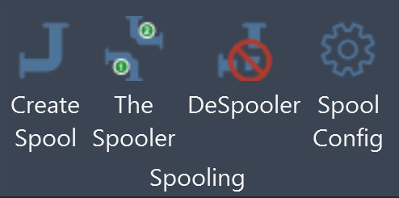
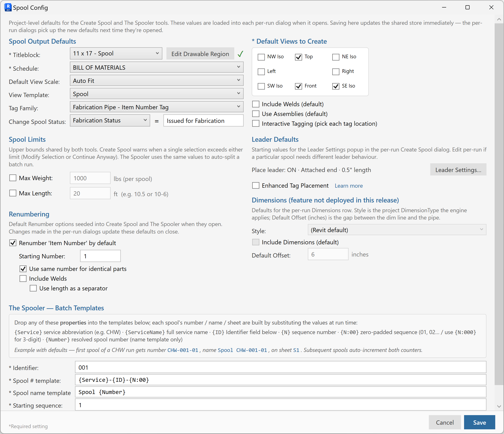
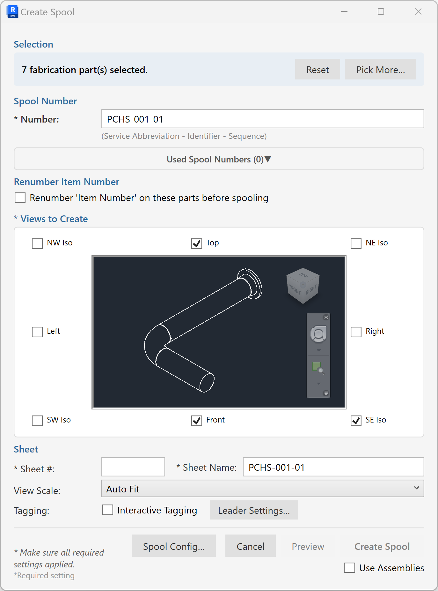
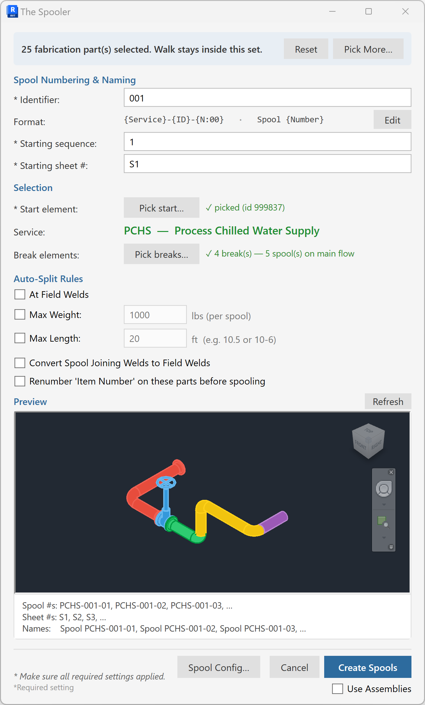

# User guide

A walkthrough of every part of the tool. Read top-to-bottom the first time;
jump to a section later.

---

## Concepts in 30 seconds

- **Spool** — a fabrication-sized subset of a pipe network drawn on its own
  sheet with ortho + iso views, tags, and (optionally) dimensions.
- **Spool Number** — a text parameter written on every part in the spool.
  The Spool Tools reserve `"Spool Number"` on `FabricationPart`. Sheets and
  views are named from it.
- **Spool Config** — project-level defaults shared by both spooling tools.
  Set once per project; both dialogs load from it on open.
- **Create Spool** — one spool at a time from a user-picked set of parts.
- **The Spooler** — many spools at once from a walk-and-split traversal.
- **DeSpooler** — reverses a spool: deletes sheet/views, clears params,
  unpins parts. Single Ctrl+Z step.

---

## Launching the tools

After installation, look for the **Spool Tools** tab in the Revit
ribbon. It contains one **Spooling** panel with four buttons:

- **Create Spool** — one-spool workflow (pick parts → sheet).
- **The Spooler** — batch workflow (walk a network, split into spools).
- **DeSpooler** — revert a spool (destructive; Ctrl+Z reversible).
- **Spool Config** — project-level defaults shared by both tools.

All four dialogs are **modeless** — you can keep working in Revit
(selecting, panning, zooming) while they're open.

---

# Spool Config — set your defaults first

Open **Spool Config** before your first spool run. The values here are
loaded into Create Spool and The Spooler when they open — so getting them
right up front saves per-run clicks.

Fields marked with `*` are required for a spool to build. The legend
`*Required setting` at the footer explains it. The Save button also refuses
to close if any required field is unset.

The dialog is organised in two columns.

## Left column

### Spool Output Defaults

- **Titleblock** (required) — the sheet family used when a spool
  creates a sheet. Only titleblocks already loaded into the project
  appear.
- **Edit Drawable Region** — sketch the rectangle **inside the
  titleblock** where views may land. Per-titleblock (11×17 and 24×36
  keep separate regions). While the sketch is active the config
  dialog hides itself so you're not fighting for focus with Revit's
  sketch tool.
- **Schedule** (required) — the Bill of Materials schedule (or
  equivalent) that gets placed on every spool sheet.
- **Default View Scale** — starting scale for the ortho + iso views.
  Per-run override lives in Create Spool.
- **View Template** — applied to every created view. Blank is
  legal (Revit-default view settings).
- **Tag Family** — the annotation family used for the tags. Set to
  `Do not place Tags` if you don't want automatic tag placement.
- **Change Spool Status** — a project text parameter (dropdown) and
  the value written into it when a spool is created. Default
  `Fabrication Status = Issued for Fabrication` matches the
  historical PCF Exporter behaviour; pick `(none — skip status
  write)` to opt out entirely.

### Spool Limits

Upper bounds shared by both tools. Create Spool warns when a single
selection exceeds either limit (Modify Selection or Continue Anyway).
The Spooler uses the same values to auto-split a batch run.

- **Max Weight** — total assembly weight (pounds). Enable + type a
  value.
- **Max Length** — longest dimension of the union bounding box of all
  parts. Enable + type a value. Accepts `10.5` (decimal feet) or
  `10-6` (feet-inches).

### Renumbering

Default Renumber options seeded into Create Spool and The Spooler
when they open. Changes made in the per-run dialogs update these
defaults on close.

- **Renumber 'Item Number' by default** — seeds the per-run
  Renumber toggle.
- **Starting Number** — first-part number for each spool.
  Subsequent parts get +1 each (unless "identical parts" collapses
  them). Resets per spool in The Spooler.
- **Use same number for identical parts** — parts with the same
  CID + size + Item Description + Item Code share one number.
- **Include Welds** — when on (default), every selected part is
  renumbered and tagged. When off, parts whose Product Range is
  "Joints" (welds, joint fittings) are skipped for Item Number
  renumbering AND tag placement — they're still pinned and shown in
  the views.
- **Use length as a separator** — pipes of different centreline
  lengths (rounded to 1/16″) get different numbers. Only meaningful
  when the identical-parts rule is on.

## Right column

### Default Views to Create

Which of the eight named directions (Top / Bottom / Left / Right /
Front / Back plus NW / NE / SW / SE isos) are ticked when Create
Spool opens. Per-run overrides live in Create Spool.

- **Include Welds** — same shared toggle as Renumbering above (this
  is a shortcut).
- **Use Assemblies** — when on, each spool becomes a Revit
  `AssemblyInstance` (members + assembly views + assembly sheet)
  instead of an ad-hoc 3D view tree on a normal sheet. Same
  visual result; different Revit primitive.
- **Interactive Tagging** — when on, the tool walks each view after
  the views are created and asks you to click where each tag goes,
  in Item Number order. Press Esc on any prompt to skip that tag.
  Off ⇒ tags auto-place using the current Leader Defaults.

### Leader Defaults

Starting values for the Leader Settings popup in Create Spool. Any
run needing different leader behaviour can override there.

- **Place leader** — ON | OFF, Attached End | Free End, and a
  paper-inches length (Free End only). Attached End uses the tag's
  own shoulder; Free End anchors the leader endpoint at the part
  centre (for pipes and elbows the tool overrides Revit's
  auto-picked surface).
- **Enhanced Tag Placement** — the smarter overlap-aware engine
  (see the Learn More link next to the checkbox for the full
  algorithm). When off, every tag goes one Tag Offset above its
  part regardless of crowding.

### Dimensions

Defaults for the per-run Dimensions row. This feature ships as
"not deployed" in v1.0.0 — the engine exists but is disabled at
the config level pending further tuning.

### The Spooler — Batch Templates

Drop any of these **properties** into the templates below; each
spool's number / name / sheet number is built by substituting the
values at run time:

- `{Service}` — service abbreviation (e.g. `CHW`)
- `{ServiceName}` — full service name
- `{ID}` — Identifier field below
- `{N}` — sequence number (`1`, `2`, …)
- `{N:00}` — zero-padded (`01`, `02`, …)
- `{N:000}` — 3-digit padding
- `{Number}` — resolved spool number (name template only)

Example with defaults: first spool of a CHW service gets number
`CHW-001-01`, name `Spool CHW-001-01`, on sheet `S1`. Subsequent
spools auto-increment both counters.

- **Identifier** — the value substituted for `{ID}`. Typical
  usage: floor, area, or run identifier.
- **Spool # template** — how spool numbers are built.
- **Spool name template** — how spool names are built.
- **Starting sequence** — first value of `{N}` in the batch.

---

# Create Spool — one spool at a time

Select fabrication parts in the model (any way you like — window drag,
Tab-cycle, ctrl-click, saved selection), then click **Create Spool**.

## Selection

The dialog opens showing the current selection count. Two buttons
adjust the pool without closing the dialog:

- **Pick More…** — hides the dialog, opens a standard Revit picker,
  reappears with the additional parts merged into the selection.
- **Reset** — clears the pool. Use when you want to start over.

If any of the selected parts are already on another spool, a
**safety-net warning** dialog fires before Create Spool opens. It
lists the affected spools and offers **Show in Model** (highlights
the offending parts), **Cancel**, and **Continue Anyway**. Continue
folds the affected parts into the new spool — the old spool's other
parts are unaffected until you explicitly DeSpool it.

## Spool Number

- **Number** (required) — auto-suggested from the service +
  identifier +  next sequence. Edit freely; the number becomes the
  sheet name and is written into every part's `Spool Number`
  parameter.
- **Used Spool Numbers** — dropdown of numbers already taken in the
  project. Handy for verifying uniqueness or picking a next value.

## Renumber Item Number

Same section that lives in Spool Config (see [Renumbering](#renumbering)
above). Values seed from Spool Config on open. Per-run adjustments
persist back on close.

## Views to Create

Tick the ortho + iso views you want on the sheet. A live preview to
the right shows a schematic of the eight positions relative to the
part axis.

## Sheet

- **Sheet #** and **Sheet Name** (required) — the sheet the views
  land on. Auto-populates from the Spool Number; edit if your
  numbering scheme differs.
- **View Scale** — override for this spool. Defaults to Spool Config.
- **Tagging** — quick toggles for **Interactive Tagging** and
  **Leader Settings…** (opens a popup with Attached/Free End
  radios, leader length in inches, Tag Offset in inches, and
  Enhanced Tag Placement).

## Footer

- **Spool Config…** — shortcut to open the shared Spool Config
  dialog if you need to change a project default mid-run. Changes
  saved there refresh this dialog automatically.
- **Cancel** — closes without touching the model.
- **Preview** — builds the spool, then opens a preview window
  (Accept keeps it as one undo step; Discard rolls everything back).
- **Create Spool** — builds directly with no preview. Fastest path.
- **Use Assemblies** — sits below Create Spool. When on, the spool
  becomes a Revit `AssemblyInstance` instead of a normal sheet with
  ad-hoc 3D views. Same visual result; different Revit primitive.

---

# The Spooler — batch multiple spools at once

The Spooler walks a connected pipe network and splits it into spools
at your chosen break points. Best for running a whole floor / a whole
riser / a whole service in one pass.

## Selection pool

Header row shows the pool the walk stays inside. **Pick More…** adds
parts; **Reset** clears it. Preselection at command launch seeds the
pool; from-scratch launches show 0 selected and wait for a Pick More.

## Spool Numbering & Naming

Compact one-line status of the current templates + Identifier +
starting sequence + starting sheet, all inherited from Spool Config.
Click **Edit** to open a popup for one-off overrides for this batch
run. Most users leave this alone and edit Spool Config instead.

## Selection

- **Start element** (required) — click **Pick start…** and pick the
  element to begin the walk. Typically an open-end or the branch off
  a riser. The dialog hides while you pick and highlights the picked
  element on return.
- **Service** — auto-detected from the Start element; shown for
  reference.
- **Break elements** — click **Pick breaks…** and pick every part
  you want to cap a spool at. Each break splits the network. Branches
  off tees always split automatically — no need to pick a tee unless
  you want to end a spool at the tee itself.

The status line to the right reports the walk result:
`✓ 4 break(s) — 5 spool(s) on main flow`.

## Auto-Split Rules

Optional constraints that further split a spool when it exceeds a
threshold:

- **At Field Welds** — split every field weld, regardless of the
  Max limits below.
- **Max Weight** — cap per-spool assembly weight. Uses the value
  from Spool Config.
- **Max Length** — cap per-spool longest bbox dimension. Uses the
  value from Spool Config.
- **Convert Spool Joining Welds to Field Welds** — after the split
  runs, every weld sitting at a spool boundary is converted to a
  Field Weld on the model (so downstream QA / iso generation sees
  the same boundary the tool used).
- **Renumber 'Item Number' on these parts before spooling** — same
  as Create Spool; runs per spool with the starting number resetting
  each time.

## Preview

3D view coloured per spool partition. **Refresh** re-runs the walk
+ split (useful after adjusting rules or breaks).

## Footer

- **Sheet numbers / sheet titles / names** — a rolling status line
  showing the numbering that will be applied on Create.
- **Spool Config…** — shortcut to project defaults.
- **Cancel** — closes without touching the model.
- **Create Spools** — kicks off the batch. Each spool is one
  transaction; overall run wraps them in a transaction group so the
  whole batch is one Ctrl+Z.
- **Use Assemblies** — right-aligned below Create Spools, same
  meaning as in Create Spool.

---

# DeSpooler — revert a spool

Select any fabrication part that belongs to a spool, then click
**DeSpooler**. It reads the Spool Number(s), finds every part / sheet
/ view / assembly matching those numbers, and offers a confirmation
dialog with counts before touching the model:

> Despool 2 spool(s)?
>
> The following will be deleted or reset:
>
>   • Fabrication parts: 14 (Spool Number + status cleared, unpinned)
>   • Assemblies: 2 (deleted — cascades to their sheets and views)
>   • Sheets: 0
>   • Views: 0
>
> Spool numbers being reverted: PCHS-001-01, PCHS-001-02

On accept, the whole operation runs in a single transaction:

1. Every matching fabrication part is unpinned and its Spool Number
   + configured status parameter are cleared.
2. Assemblies for those spools are deleted (Revit cascades sheet +
   view deletion).
3. Standalone spool sheets (non-assembly runs) are deleted along
   with their placed views.
4. Schedules stay put — they're reusable across spools.

Ctrl+Z restores the deleted sheets, views, and assemblies plus the
cleared parameters and pin state in one step.

Use DeSpooler when:

- The spool was created against the wrong service / template and you
  want to redo it clean.
- A part was accidentally added / omitted and you want to rebuild
  the affected spool from a corrected selection.
- You're cleaning up a project before archiving (remove all spools).

---

## Frequently asked

### "Create Spool refuses to build — the button is greyed out."

Hover the button. The tooltip lists which required field is unset.
Common causes:

- No Titleblock or no Schedule in Spool Config.
- No Tag Family picked in Spool Config (fine if you set it to
  `Do not place Tags`, not fine if it's blank).
- No drawable region sketched for the chosen titleblock.
- Number / Sheet # / Sheet Name blank.

### "My tags are all landing in the same spot regardless of Enhanced Tag Placement."

Two things to check:

1. Confirm **Enhanced Tag Placement** is on (Spool Config → Leader
   Defaults, or Leader Settings popup per run). Off ⇒ every tag
   goes one Tag Offset above its part.
2. If it's on and behaviour still looks off, confirm the **Tag
   Offset** in Leader Settings isn't set to 0 — the 3 tiers scale
   off that value, and 0 collapses them all to zero offset.

### "Leader from the tag attaches to a weld, not the pipe."

Set Leader Settings to **Free End**. The tool overrides Revit's
auto-picked surface on pipes and elbows and anchors the leader
endpoint at the part centre.

### "How do I share Spool Config across projects?"

Currently config lives on the project via ExtensibleStorage. Workarounds:

- Save a template Revit project with the desired Spool Config, then
  start new projects from that template.
- A JSON export/import feature is on the backlog —
  [contributions welcome](https://github.com/sbuchanan01/spool-tools-for-revit/issues).

### "The Spooler split my run in a place I didn't expect."

Check whether the split happened at a **branch off a tee** — those
are automatic. If it happened mid-run on a straight, check the
**Max Weight** / **Max Length** rules; they auto-split when a spool
would exceed a limit.

### "I want to add parts to an existing spool without deleting it."

Select the extra parts + at least one part that's already on the
spool, run **Create Spool**. The safety-net dialog fires; pick
**Continue Anyway** and the new selection folds into the existing
spool.

### "Interactive Tagging asked me for every tag — is there a way to skip specific ones?"

Press Esc on any prompt to skip that tag (the tag isn't created).
Every subsequent tag still gets its prompt.

### "DeSpooler deleted my schedule."

It doesn't — schedules are reusable across spools so DeSpooler leaves
them alone. If your schedule disappeared, something else deleted it.
Check the undo history.

---

## Reporting bugs and asking for features

[GitHub Issues](https://github.com/sbuchanan01/spool-tools-for-revit/issues).

When reporting a placement or split bug, please include:

- Revit version + build number (Help → About).
- A screenshot of the relevant dialog with the settings visible.
- A minimal sample model (or a description of the part
  configuration).
- What you expected, what happened.
